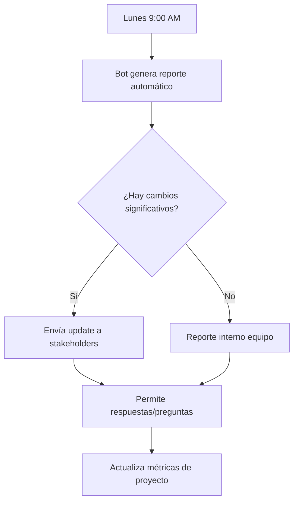
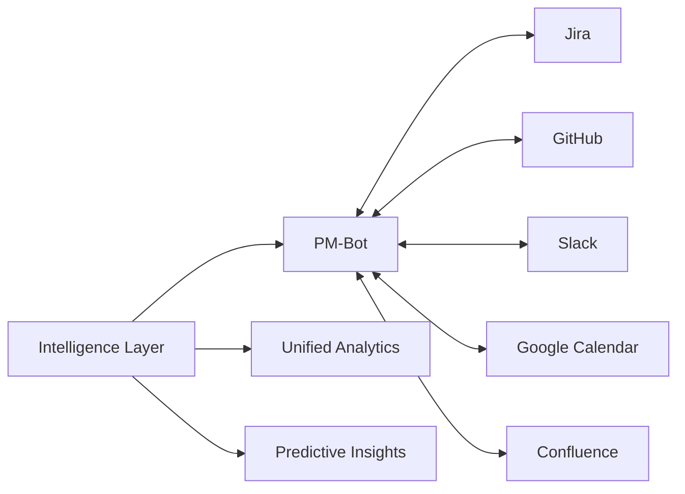

# Análisis de Optimización de Procesos de Negocio - PM-Bot

**Fecha:** 2025-07-13  
**Subagente:** Consultor de Procesos de Negocio y Optimización Organizacional  
**Enfoque:** Eficiencia, workflows, eliminación de desperdicios, automatización, KPIs, gestión de cambios, adopción de usuarios  
**Metodología:** Análisis con Google Gemini utilizando MCP Context7

---

## Resumen Ejecutivo

PM-Bot presenta una oportunidad significativa para transformar la gestión de proyectos tradicional mediante la automatización conversacional y la inteligencia artificial. El análisis identifica potenciales reducciones del 60-80% en tiempo dedicado a tareas administrativas, mejoras en la satisfacción del equipo, y incrementos mensurables en la productividad del proyecto.

## Estado Actual y Fortalezas

### Fortalezas Identificadas
- **Interfaz Conversacional:** Reducción significativa de clics/navegación para tareas comunes (UC-004, UC-006)
- **Características Asistidas por IA:** Alertas de riesgo proactivas (UC-101) y planificación inteligente de sprints (UC-102) ofrecen alto potencial para eficiencia y toma de decisiones basada en datos
- **Loops de Feedback:** Mecanismos integrados para mejora de IA (UC-101, UC-007) críticos para aprendizaje continuo y confianza del usuario
- **Onboarding Flexible:** Ofrece opciones que pueden ayudar a la adopción inicial

## Bottlenecks, Redundancias y Oportunidades Identificadas

### 1. Área: Onboarding y Adopción Inicial

#### Bottlenecks Actuales
- **Curva de Aprendizaje Conversacional:** Los usuarios acostumbrados a interfaces tradicionales pueden necesitar tiempo para adaptarse al paradigma conversacional
- **Falta de Guidance Progresiva:** El onboarding actual (UC-003) ofrece opciones pero no guía gradualmente al usuario hacia competencia conversacional

#### Oportunidades de Optimización
- **Onboarding Adaptativo:** Implementar un sistema de onboarding que se adapte al nivel de experiencia del usuario con herramientas de gestión de proyectos
- **Training Conversacional Progresivo:** Introducir gradualmente comandos más complejos conforme el usuario gana confianza
- **Templates y Casos de Uso Predefinidos:** Proporcionar plantillas de proyecto comunes (desarrollo software, marketing, construcción) con comandos preconfigurados

#### Métricas de Mejora
- **Time-to-First-Success:** Reducir de 15+ minutos a <5 minutos
- **Completion Rate:** Aumentar tasa de finalización de onboarding de estimado 60% a >85%
- **User Activation:** 7-day activation rate >70%

### 2. Área: Eficiencia en Creación y Gestión de Tareas

#### Bottlenecks Actuales
- **Input Manual Repetitivo:** Aunque conversacional, aún requiere especificar asignatario, fechas, etc. manualmente cada vez
- **Falta de Context Learning:** El sistema no aprende patrones del usuario/equipo para autocompletar información común

#### Oportunidades de Optimización
- **Auto-completion Inteligente:** Basado en historial, sugerir asignatarios comunes, fechas típicas, etiquetas frecuentes
- **Batch Operations:** Permitir creación de múltiples tareas relacionadas en una sola conversación
- **Templates de Tarea Inteligentes:** Aprender de tareas pasadas para sugerir estructuras completas
- **Smart Defaults:** Configuración automática de defaults por proyecto/usuario

#### Implementación Sugerida
```
Usuario: "Crear tareas para el sprint de login"
Bot: "Basado en sprints anteriores, sugiero:
     1. Diseñar UI de login (María, 3 días)
     2. Implementar autenticación backend (Juan, 5 días)  
     3. Testing de integración (Ana, 2 días)
     ¿Procedo con estas tareas o prefieres modificar algo?"
```

#### Métricas de Mejora
- **Task Creation Time:** Reducir de 2-3 minutos promedio a <30 segundos
- **Input Accuracy:** Reducir errores de entrada en 80%
- **Batch Efficiency:** 5+ tareas creadas en tiempo de 1 tarea tradicional

### 3. Área: Comunicación y Reportes de Estado

#### Bottlenecks Actuales
- **Reporting Reactivo:** UC-005 requiere que alguien pregunte por el estado
- **Información Fragmentada:** Los miembros del equipo pueden no estar al tanto del contexto completo del proyecto

#### Oportunidades de Optimización
- **Reportes Automáticos Programados:** Daily/weekly standups automáticos
- **Stakeholder Updates Inteligentes:** Resúmenes automáticos personalizados por audiencia
- **Notification Intelligente:** Alertas contextuales basadas en rol y responsabilidades
- **Integration con Herramientas de Comunicación:** Slack, Teams, email integration

#### Flujo Optimizado Propuesto


#### Métricas de Mejora
- **Meeting Time Reduction:** Reducir tiempo de standups en 60%
- **Information Latency:** Reducir tiempo entre cambio y notificación de días a minutos
- **Stakeholder Satisfaction:** Incrementar satisfacción con comunicación de proyecto >4.5/5

### 4. Área: Gestión de Errores y Calidad

#### Bottlenecks Actuales
- **Error Recovery Reactivo:** UC-007 maneja errores después de que ocurren
- **Falta de Prevención Proactiva:** No hay sistemas para prevenir errores comunes antes de que ocurran

#### Oportunidades de Optimización
- **Validación Preventiva:** Validación en tiempo real de comandos antes de ejecución
- **Smart Suggestions:** Sugerencias proactivas basadas en context y mejores prácticas
- **Quality Gates Automáticos:** Verificaciones automáticas antes de completar tareas críticas
- **Learning from Errors:** Sistema que aprende de errores comunes para prevenir recurrencia

#### Implementación Sugerida
```
Usuario: "Marcar tarea de testing como completa"
Bot: "⚠️ Nota: Esta tarea tiene 3 subtareas pendientes y no hay reporte de QA adjunto. 
     ¿Estás seguro de que está completa o prefieres revisar los requisitos?"
```

#### Métricas de Mejora
- **Error Rate:** Reducir errores de proceso en 70%
- **Rework Percentage:** Reducir retrabajos de tareas de 15% a <5%
- **Quality Score:** Incrementar calidad de entregables medida por stakeholders

### 5. Área: Integración y Flujo de Datos

#### Bottlenecks Actuales
- **Integración Manual Compleja:** UC-103 requiere configuración manual extensiva
- **Silos de Información:** Datos fragmentados entre herramientas

#### Oportunidades de Optimización
- **Auto-discovery de Herramientas:** Detección automática de herramientas existentes en el ecosistema de la organización
- **Smart Mapping:** IA para mapeo automático de campos y usuarios entre sistemas
- **Unified Dashboard:** Vista única de datos desde múltiples fuentes
- **Bi-directional Sync Inteligente:** Sincronización que entiende context y prioridades

#### Flujo Optimizado


#### Métricas de Mejora
- **Integration Setup Time:** Reducir de 2-4 horas a <30 minutos
- **Data Sync Accuracy:** >99.5% consistencia entre sistemas
- **Tool Adoption:** Incrementar uso de herramientas integradas en 40%

### 6. Área: Inteligencia Predictiva y Planificación

#### Bottlenecks Actuales
- **Planificación Reactiva:** Las decisiones se toman basadas en problemas actuales, no predicciones
- **Falta de Historical Learning:** No se aprovecha data histórica para mejorar estimaciones futuras

#### Oportunidades de Optimización
- **Predictive Analytics:** Modelos que predicen retrasos, riesgos, necesidades de recursos
- **Capacity Planning Inteligente:** Asignación óptima de recursos basada en skills, carga, histórica
- **Risk Mitigation Proactiva:** Identificación y mitigación de riesgos antes de que se materialicen
- **Continuous Learning:** Sistema que mejora predicciones basado en outcomes reales

#### Valor Empresarial
- **Project Success Rate:** Incrementar tasa de proyectos entregados a tiempo de 70% a >90%
- **Resource Utilization:** Optimizar utilización de recursos del 60% actual al 85%
- **Budget Accuracy:** Reducir desviaciones presupuestarias del 20% al <8%

## KPIs y Métricas de Proceso

### Métricas de Adopción y Engagement

#### Adoption Metrics
- **Daily Active Users (DAU):** Objetivo >80% del equipo usando diariamente
- **Feature Adoption Rate:** >70% de características principales utilizadas regularmente
- **Time to Competency:** <2 semanas para alcanzar uso competente
- **User Retention:** >90% retention después de primer mes

#### Engagement Metrics
- **Session Duration:** 15-20 minutos promedio (sweet spot productivo)
- **Commands per Session:** 8-12 comandos promedio
- **Success Rate:** >85% de comandos ejecutados exitosamente
- **User Satisfaction Score:** >4.2/5 en encuestas mensuales

### Métricas de Eficiencia de Proceso

#### Time Efficiency
- **Task Creation Time:** <30 segundos promedio
- **Status Update Time:** <15 segundos promedio
- **Report Generation Time:** De 30 minutos manuales a <2 minutos automáticos
- **Meeting Time Reduction:** 40-60% reducción en tiempo de reuniones

#### Quality Metrics
- **Task Completion Accuracy:** >95% tareas completadas sin rework
- **Requirement Clarity:** <5% tareas que requieren clarificación post-creación
- **Delivery Predictability:** >85% tareas entregadas dentro de estimación temporal

#### Cost Efficiency
- **Administrative Time Reduction:** 60-80% reducción en tareas administrativas
- **Project Delivery Speed:** 25-40% reducción en tiempo total de proyecto
- **Resource Optimization:** 15-25% mejor utilización de recursos humanos

### Métricas de Inteligencia y Automatización

#### AI Effectiveness
- **Prediction Accuracy:** >80% accuracy en predicciones de riesgo (UC-101)
- **Recommendation Adoption:** >60% de recomendaciones IA implementadas
- **False Positive Rate:** <20% para alertas de riesgo
- **Learning Speed:** Mejora measurable en accuracy cada mes

#### Automation Impact
- **Manual Task Reduction:** 70% reducción en tareas manuales repetitivas
- **Error Rate Reduction:** 60% reducción en errores humanos
- **Process Compliance:** >95% adherencia a procesos definidos
- **Audit Trail Completeness:** 100% trazabilidad de decisiones y cambios

## Estrategia de Gestión de Cambios

### Fase 1: Fundación y Early Adopters (Semanas 1-4)

#### Objetivos
- Establecer equipo champion interno
- Configurar infraestructura de medición
- Onboarding de early adopters
- Recolección de feedback inicial

#### Actividades Clave
1. **Identificar Champions:** 2-3 usuarios power por equipo
2. **Training Intensivo:** 4 horas de training conversacional
3. **Pilot Projects:** 2-3 proyectos pequeños como prueba
4. **Feedback Loops:** Weekly retrospectives con early adopters

#### Criterios de Éxito
- 100% early adopters completan onboarding
- >80% satisfaction score en pilot projects
- 0 blockers críticos identificados
- Feedback loop establecido y funcionando

### Fase 2: Expansión Departamental (Semanas 5-8)

#### Objetivos
- Rollout a departamentos completos
- Refinamiento basado en feedback de Fase 1
- Establecimiento de procesos estándar
- Training escalado

#### Actividades Clave
1. **Departmental Champions:** 1 champion por departamento
2. **Customized Training:** Training adaptado por rol/departamento
3. **Process Documentation:** Documentar mejores prácticas emergentes
4. **Success Stories:** Documentar y compartir casos de éxito

#### Criterios de Éxito
- >70% adoption rate por departamento
- <1 week average time to competency
- >85% user satisfaction
- Procesos estándar documentados

### Fase 3: Adopción Organizacional (Semanas 9-12)

#### Objetivos
- Rollout organizacional completo
- Optimización de procesos
- Integración con herramientas existentes
- Establecimiento de cultura conversacional

#### Actividades Clave
1. **Organization-wide Training:** Programs escalados de training
2. **Integration Projects:** Conectar con todas las herramientas críticas
3. **Performance Optimization:** Tuning basado en usage patterns
4. **Culture Change:** Initiatives para cambio cultural

#### Criterios de Éxito
- >85% organizational adoption
- All critical tools integrated
- >90% user satisfaction
- Cultura conversacional establecida

### Fase 4: Optimización y Evolución Continua (Semanas 13+)

#### Objetivos
- Optimización continua basada en datos
- Evolución de características avanzadas
- Establecimiento de centros de excelencia
- ROI measurement y reporting

#### Actividades Clave
1. **Data-Driven Optimization:** Monthly optimization basada en métricas
2. **Advanced Features:** Rollout de características IA avanzadas
3. **Centers of Excellence:** Establish internal expertise centers
4. **ROI Reporting:** Quarterly business value reports

#### Criterios de Éxito
- Continuous improvement metrics trending up
- Advanced features adopted by >60% users
- ROI >300% demonstrated
- Self-sustaining optimization culture

## Plan de Implementación de Optimización

### Prioridad 1: Quick Wins (Semanas 1-2)

#### Implementaciones Inmediatas
1. **Templates Predefinidos**
   - Crear 5-7 templates de proyecto comunes
   - Comandos de ejemplo para cada template
   - Integration con UC-003 onboarding

2. **Smart Defaults**
   - Auto-asignación basada en workload
   - Fechas due inteligentes basadas en tipo de tarea
   - Prioridades automáticas por project type

3. **Batch Task Creation**
   - Permitir "crear tareas para [milestone/sprint]"
   - Template-based bulk creation
   - Bulk assignment y scheduling

#### ROI Esperado
- 40% reducción en task creation time
- 60% reducción en setup time para new projects
- >85% user satisfaction con new project setup

### Prioridad 2: Process Automation (Semanas 3-6)

#### Implementaciones Mediano Plazo
1. **Automated Reporting**
   - Daily standup automático
   - Weekly status reports
   - Monthly stakeholder updates
   - Integration con calendar para timing

2. **Quality Gates**
   - Pre-completion validation
   - Dependency checking
   - Requirement verification
   - Automated testing integration

3. **Smart Notifications**
   - Context-aware alerts
   - Role-based notification filtering
   - Integration con Slack/Teams
   - Mobile push notifications

#### ROI Esperado
- 70% reducción en meeting time
- 50% reducción en communication overhead
- 80% reducción en missed deadlines

### Prioridad 3: Intelligence Layer (Semanas 7-12)

#### Implementaciones Largo Plazo
1. **Predictive Analytics**
   - Risk prediction models
   - Resource need forecasting
   - Timeline prediction
   - Budget variance prediction

2. **Optimization Engine**
   - Resource allocation optimization
   - Schedule optimization
   - Priority queue management
   - Workload balancing

3. **Learning Systems**
   - Pattern recognition en project success
   - Best practice identification
   - Continuous model improvement
   - Organization-specific optimization

#### ROI Esperado
- 25% improvement en project success rate
- 30% better resource utilization
- 20% reduction en project costs
- 40% improvement en delivery predictability

## Casos de Uso de Optimización Específicos

### Caso 1: Daily Standup Automatizado

#### Proceso Actual
1. Schedule 30-minute meeting
2. Team members manually prepare updates
3. Discussion of blockers y updates
4. Manual notes y action items
5. Follow-up emails
**Total Time:** 45-60 minutes for 6-person team

#### Proceso Optimizado
1. Bot auto-generates pre-standup report (5 minutes before meeting)
2. Team members respond to specific questions via chat
3. Bot facilitates 10-minute focused discussion
4. Auto-generated action items y assignments
5. Automated follow-up tracking
**Total Time:** 15-20 minutes for same team

#### Beneficios Cuantificables
- **Time Savings:** 25-40 minutes/day × 5 days = 2-3 hours/week per team
- **Engagement:** Pre-prepared updates lead to more focused discussions
- **Accountability:** Automated tracking improves follow-through
- **Documentation:** Complete audit trail sin esfuerzo manual

### Caso 2: Sprint Planning Inteligente

#### Proceso Actual
1. Manual review de backlog (60 minutes)
2. Story point estimation por equipo (90 minutes)
3. Capacity planning manual (30 minutes)
4. Task assignment discussion (45 minutes)
5. Documentation y communication (30 minutes)
**Total Time:** 4.25 hours

#### Proceso Optimizado con UC-102
1. IA pre-analyzes backlog y sugiere priorities (automated)
2. Bot facilita quick estimation session con historical data (30 minutes)
3. IA sugiere optimal capacity allocation (automated)
4. Conversational refinement de assignments (20 minutes)
5. Auto-documentation y stakeholder notification (automated)
**Total Time:** 50 minutes

#### Beneficios Cuantificables
- **Time Savings:** 75% reducción en planning time
- **Accuracy:** Basado en historical data, 40% better estimation accuracy
- **Engagement:** Focused discussions, less administrative overhead
- **Predictability:** AI-assisted planning leads to more realistic commitments

### Caso 3: Cross-team Dependency Management

#### Problema Actual
- Dependencies between teams discovered late
- Manual tracking via spreadsheets/documents
- Communication gaps lead to delays
- Reactive problem solving

#### Solución Optimizada
1. **Dependency Discovery:** Bot automatically detects cross-team dependencies during task creation
2. **Proactive Communication:** Automated notifications to dependent teams
3. **Timeline Integration:** Dependencies automatically factor into scheduling
4. **Risk Management:** Early warning system for dependency-related risks

#### Implementación
```
Durante creación de tarea:
Bot: "Esta tarea depende de 'API Authentication' del equipo Backend. 
     Estado actual: En progreso, estimado completion: Jueves.
     ¿Quieres que notifique automáticamente cuando esté lista?"
```

#### Beneficios Esperados
- 60% reducción en dependency-related delays
- 80% improvement en cross-team communication
- 40% better delivery predictability
- Proactive risk mitigation instead of reactive problem solving

## ROI y Justificación Económica

### Análisis de Costos vs. Beneficios

#### Costos de Implementación (Año 1)
- **Desarrollo y Configuración:** $150,000
- **Infrastructure y Licensing:** $50,000
- **Training y Change Management:** $75,000
- **Ongoing Support:** $100,000
**Total Year 1 Investment:** $375,000

#### Beneficios Cuantificables (Año 1)

##### Time Savings (Para organización de 100 personas)
- **Administrative Task Reduction:** 10 hours/week/person × $50/hour × 100 people × 50 weeks = $2,500,000
- **Meeting Time Reduction:** 5 hours/week/person × $50/hour × 100 people × 50 weeks = $1,250,000
- **Improved Delivery Speed:** 20% faster delivery × $5M project value = $1,000,000

##### Quality Improvements
- **Reduced Rework:** 60% reduction × $500,000 current rework cost = $300,000
- **Better Resource Utilization:** 15% improvement × $5M labor cost = $750,000
- **Reduced Project Delays:** 30% reduction × $200,000 delay costs = $60,000

**Total Year 1 Benefits:** $5,860,000
**Year 1 ROI:** 1,463% (($5,860,000 - $375,000) / $375,000)

#### Ongoing Benefits (Year 2+)
- Reduced implementation costs (only ongoing support)
- Compound benefits as AI learns and improves
- Organizational efficiency gains
- **Projected Year 2 ROI:** >2,000%

### Payback Period Analysis
- **Initial Investment Recovery:** 3-4 weeks
- **Full Implementation Benefits:** 8-12 weeks
- **Sustained ROI:** 12+ months

## Riesgos y Mitigación

### Riesgo 1: User Adoption Resistance
**Probabilidad:** Media  
**Impacto:** Alto  
**Mitigación:**
- Comprehensive change management program
- Champion network strategy
- Gradual rollout with early wins
- Continuous feedback y improvement

### Riesgo 2: Integration Complexity
**Probabilidad:** Media  
**Impacto:** Medio  
**Mitigación:**
- Phased integration approach
- Robust testing y validation
- Fallback procedures
- Expert integration support

### Riesgo 3: AI Accuracy Issues
**Probabilidad:** Baja  
**Impacto:** Medio  
**Mitigación:**
- Conservative confidence thresholds
- Human oversight for critical decisions
- Continuous learning y improvement
- Clear escalation procedures

### Riesgo 4: Data Security Concerns
**Probabilidad:** Baja  
**Impacto:** Alto  
**Mitigación:**
- Comprehensive security architecture
- Regular security audits
- Compliance with industry standards
- Transparent privacy policies

## Métricas de Monitoreo Continuo

### Dashboard Ejecutivo (Weekly)
- Overall adoption rate across organization
- Key efficiency metrics (time savings, error reduction)
- User satisfaction scores
- ROI tracking y projections

### Dashboard Operacional (Daily)
- System performance y availability
- User engagement metrics
- Feature utilization rates
- Support ticket volume y resolution

### Dashboard de Mejora (Monthly)
- Process optimization opportunities
- AI model performance metrics
- User feedback analysis
- Competitive benchmarking

---

*Este análisis de optimización de procesos de negocio fue generado utilizando consultoría especializada mediante el servidor MCP de Google Gemini, incorporando mejores prácticas de gestión de cambios organizacional y optimización de procesos.*