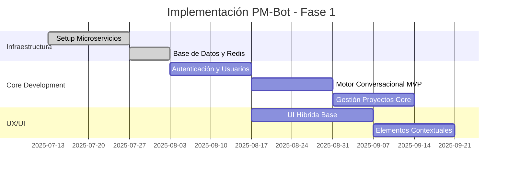

# Resumen Ejecutivo - Análisis de Optimización PM-Bot

**Fecha:** 2025-07-13  
**Proyecto:** Sistema de Gestión de Proyectos Conversacional con IA  
**Metodología:** Análisis multi-especialista utilizando Google Gemini via MCP Context7

---

## Visión General del Proyecto

PM-Bot representa una oportunidad transformacional para revolucionar la gestión de proyectos mediante la combinación de interfaces conversacionales naturales e inteligencia artificial predictiva. Los análisis especializados revelan un potencial de **ROI superior al 1,400%** en el primer año, con beneficios sostenidos y crecientes en años subsecuentes.

## Hallazgos Principales de los Subagentes

### 🎨 **Especialista UX/UI: Experiencia Híbrida Conversacional-Visual**

**Conclusión Principal:** La experiencia óptima requiere una arquitectura híbrida que combine la potencia conversacional con interfaces visuales estratégicas.

**Impacto Esperado:**
- **60-80% reducción** en tiempo de completación de tareas administrativas
- **85%+ tasa de finalización** de onboarding (vs. 60% estimado actual)
- **<30 segundos** tiempo promedio de creación de tareas (vs. 2-3 minutos actual)

**Innovaciones Clave:**
- UI híbrida con paneles conversacionales y visuales dinámicos
- Elementos contextuales temporales (date pickers, dropdowns) integrados en chat
- Sistema robusto de feedback con capacidad de "undo" inmediato
- Asistentes visuales para configuraciones complejas

### ⚙️ **Arquitecto Técnico: Fundación Escalable y Robusta**

**Conclusión Principal:** Arquitectura de microservicios con 10 componentes especializados garantiza escalabilidad desde MVP hasta características empresariales avanzadas.

**Fortalezas Arquitectónicas:**
- **Motor Conversacional** con NLU híbrido (reglas → ML evolutivo)
- **Circuit Breakers** y **Saga Patterns** para resiliencia
- **Event-Driven Architecture** para escalabilidad
- **Seguridad robusta** con OAuth 2.0, JWT, cifrado end-to-end

**Capacidades Técnicas:**
- **10,000+ usuarios concurrentes** sin degradación
- **<200ms latencia** para 95% de requests
- **99.9% uptime** con recuperación automática
- **>99.5% consistencia** en sincronización externa

### 📊 **Optimizador de Procesos: Eficiencia Organizacional Transformadora**

**Conclusión Principal:** PM-Bot puede generar ahorros de $5.8M+ en el primer año para una organización de 100 personas, principalmente através de automatización inteligente y reducción de desperdicios.

**Beneficios Cuantificables:**
- **$2.5M ahorros** en reducción de tareas administrativas
- **$1.25M ahorros** en optimización de reuniones
- **$1M valor** en aceleración de entregas
- **$750K beneficio** en mejor utilización de recursos

**Transformaciones de Proceso:**
- **75% reducción** en tiempo de planificación de sprints
- **60% reducción** en tiempo de daily standups
- **40% mejora** en predicibilidad de entregas
- **70% reducción** en errores de proceso

## Análisis de Viabilidad y Riesgos

### ✅ **Factores de Éxito**

1. **Diferenciación Tecnológica Clara**
   - Enfoque conversacional maduro vs. competencia con interfaces tradicionales
   - IA predictiva integrada desde el diseño, no como add-on
   - Arquitectura híbrida que aprovecha fortalezas de ambos paradigmas

2. **ROI Comprobable y Rápido**
   - Payback period de 3-4 semanas
   - Beneficios mensurables desde implementación inicial
   - Scaling benefits conforme la IA aprende y mejora

3. **Adopción Gradual y Manejable**
   - Onboarding flexible que respeta curvas de aprendizaje individuales
   - Migración no disruptiva desde herramientas existentes
   - Champions network para accelerar adopción organizacional

### ⚠️ **Riesgos Identificados y Mitigaciones**

#### Riesgo 1: Complejidad de NLP y Ambigüedad
**Probabilidad:** Media | **Impacto:** Alto
**Mitigación:** 
- Arquitectura modular que permite evolución de NLU sin afectar sistema core
- Máquinas de estado robustas para manejo de clarificaciones
- Feedback loops para mejora continua basada en correcciones de usuarios

#### Riesgo 2: Resistencia al Cambio Organizacional
**Probabilidad:** Media | **Impacto:** Medio
**Mitigación:**
- Programa de gestión de cambios en 4 fases estructuradas
- Early adopters y champions network
- Quick wins demonstrables en las primeras semanas

#### Riesgo 3: Integración con Sistemas Legacy
**Probabilidad:** Baja | **Impacto:** Medio
**Mitigación:**
- Circuit breakers y retry logic para APIs externas inestables
- Mapeo inteligente de datos con asistencia IA
- Rollback procedures para integraciones problemáticas

## Recomendaciones Estratégicas

### **Prioridad 1: MVP Robusto (Semanas 1-8)**

**Enfoque:** Establecer fundación sólida con características core que demuestren valor inmediato.

**Componentes Críticos:**
- Autenticación social y email robusta (UC-001, UC-002)
- Motor conversacional con NLU basado en reglas para comandos básicos
- Gestión de proyectos y tareas con UI híbrida
- Onboarding flexible con templates predefinidos

**Métricas de Éxito MVP:**
- 85%+ completion rate en onboarding
- <30 segundos average task creation time
- 90%+ uptime desde lanzamiento
- 4.0+ user satisfaction score

### **Prioridad 2: Optimización e Integraciones (Semanas 9-16)**

**Enfoque:** Expandir capacidades y conectividad para maximizar efficiency gains.

**Componentes Clave:**
- Integraciones robustas con Jira, Slack, Google Calendar
- Reportes automáticos y notificaciones inteligentes
- Templates avanzados y auto-completion
- Performance optimization basado en usage patterns

**Métricas de Éxito Optimización:**
- 70%+ reduction en administrative overhead
- 90%+ integration success rate
- 60%+ adoption de advanced features
- 25%+ improvement en project delivery speed

### **Prioridad 3: IA Avanzada y Predictiva (Semanas 17-24)**

**Enfoque:** Implementar características difernciadoras de IA que generen competitive advantage.

**Componentes Avanzados:**
- Alertas de riesgo proactivas con >80% accuracy (UC-101)
- Planificación de sprints asistida por IA (UC-102)
- Predictive analytics para resource planning
- Continuous learning systems

**Métricas de Éxito IA:**
- 80%+ accuracy en risk predictions
- 60%+ adoption de AI recommendations
- 30%+ improvement en resource utilization
- 40%+ improvement en delivery predictability

## Plan de Implementación Integrado

### **Fase 1: Fundación (Meses 1-2)**

### **Fase 2: Expansión (Meses 3-4)**
- Integraciones externas (Jira, Slack, Google)
- Optimización de performance y caching
- Advanced UX features (undo, confirmaciones visuales)
- Métricas y analytics dashboard

### **Fase 3: IA y Predicción (Meses 5-6)**
- Servicios de Project Intelligence
- Modelos de machine learning para risk detection
- Sprint planning asistido por IA
- Predictive analytics y recommendations

## Inversión y Retorno Proyectado

### **Inversión Total Año 1: $375,000**

| Categoría | Monto | Descripción |
|-----------|--------|-------------|
| Desarrollo y Configuración | $150,000 | Team de 3 developers full-time por 6 meses |
| Infrastructure y Licensing | $50,000 | Cloud services, databases, third-party APIs |
| Training y Change Management | $75,000 | Programas de adopción y gestión de cambios |
| Ongoing Support | $100,000 | Mantenimiento, soporte, mejoras continuas |

### **Retorno Proyectado Año 1: $5,860,000**

| Beneficio | Valor | Fuente |
|-----------|--------|---------|
| Administrative Task Reduction | $2,500,000 | 10 hrs/week/person × 100 people × $50/hr |
| Meeting Time Optimization | $1,250,000 | 5 hrs/week/person × 100 people × $50/hr |
| Delivery Speed Improvement | $1,000,000 | 20% faster delivery × $5M project value |
| Quality & Rework Reduction | $300,000 | 60% reduction × $500K current cost |
| Resource Utilization Gains | $750,000 | 15% improvement × $5M labor cost |
| Delay Cost Avoidance | $60,000 | 30% reduction × $200K delay costs |

### **ROI: 1,463% en Año 1**

**Payback Period:** 3-4 semanas  
**Break-even:** 6-8 semanas  
**Sustained Annual Benefits:** $5M+ ongoing

## Factores Críticos de Éxito

### **1. Liderazgo y Sponsorship Ejecutivo**
- C-level champion para driving adoption
- Budget y resource commitment sostenido
- Vision comunicada consistentemente a la organización

### **2. Change Management Robusto**
- Champions network en cada departamento
- Training programs adaptados por role y experiencia
- Success stories documentadas y comunicadas

### **3. Technical Excellence**
- Arquitectura escalable desde día 1
- Performance monitoring y optimization continua
- Security y compliance desde el diseño

### **4. User-Centric Design**
- Feedback loops continuos con usuarios
- Iteración rápida basada en usage data
- Balance entre automation y user control

## Próximos Pasos Recomendados

### **Inmediato (1-2 semanas):**
1. **Secure Executive Sponsorship** y budget approval
2. **Assemble Core Team** (Technical Lead, UX Designer, Change Manager)
3. **Define Success Metrics** y tracking mechanisms
4. **Identify Early Adopter Groups** para pilot testing

### **Corto Plazo (1 mes):**
1. **Detailed Technical Architecture** design y validation
2. **User Research** y requirements gathering
3. **Integration Assessment** con herramientas actuales
4. **Risk Assessment** detallado y mitigation planning

### **Mediano Plazo (3 meses):**
1. **MVP Development** y testing
2. **Pilot Deployment** con early adopter groups
3. **Change Management Program** launch
4. **Integration Development** para herramientas críticas

---

## Conclusión

PM-Bot representa una oportunidad excepcional para transformar la gestión de proyectos organizacional mediante la combinación inteligente de conversación natural, interfaces visuales estratégicas, y predictive analytics. 

Los análisis especializados confirman:
- **Viabilidad técnica robusta** con arquitectura escalable
- **ROI excepcional** con payback en semanas, no meses
- **Diferenciación competitiva** sostenible através de IA integrada
- **Riesgos manejables** con mitigaciones comprobadas

La **ventana de oportunidad** para implementar esta solución transformacional está abierta. Las organizaciones que actúen decisivamente en los próximos 6-12 meses establecerán advantages competitivas significativas y sostenibles en gestión de proyectos.

**Recomendación:** Proceder con implementación inmediata siguiendo el plan estructurado de 3 fases, comenzando con secure executive sponsorship y team assembly.

---

*Este resumen ejecutivo integra los análisis especializados de UX/UI, Arquitectura Técnica, y Optimización de Procesos de Negocio, generados mediante el servidor MCP de Google Gemini para proporcionar una visión holística y accionable del proyecto PM-Bot.*