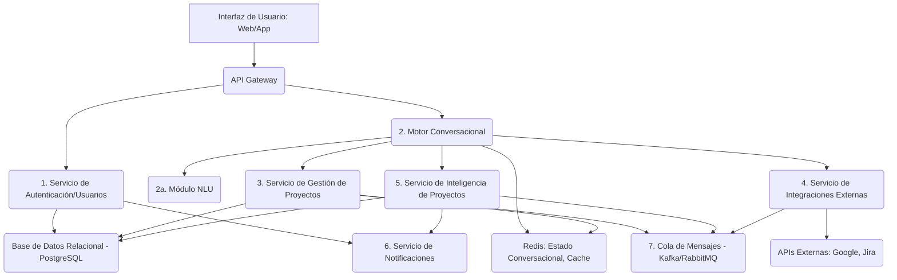
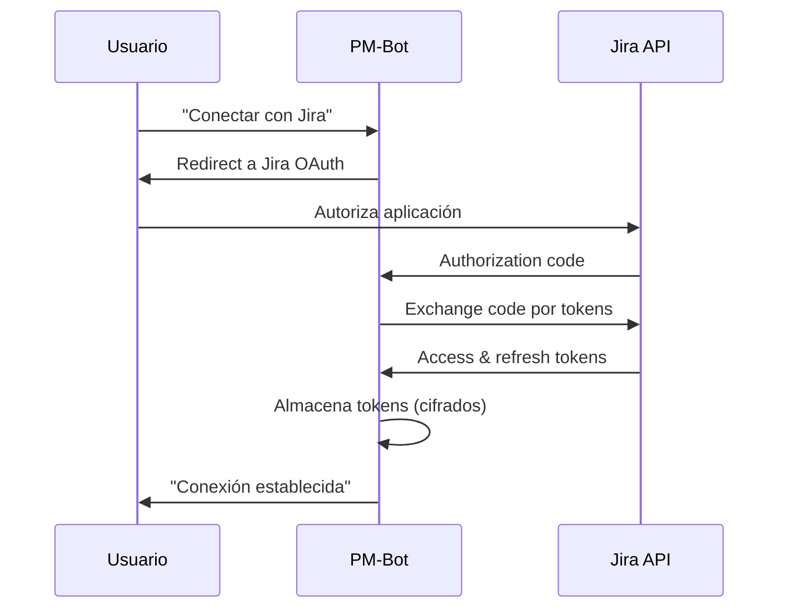
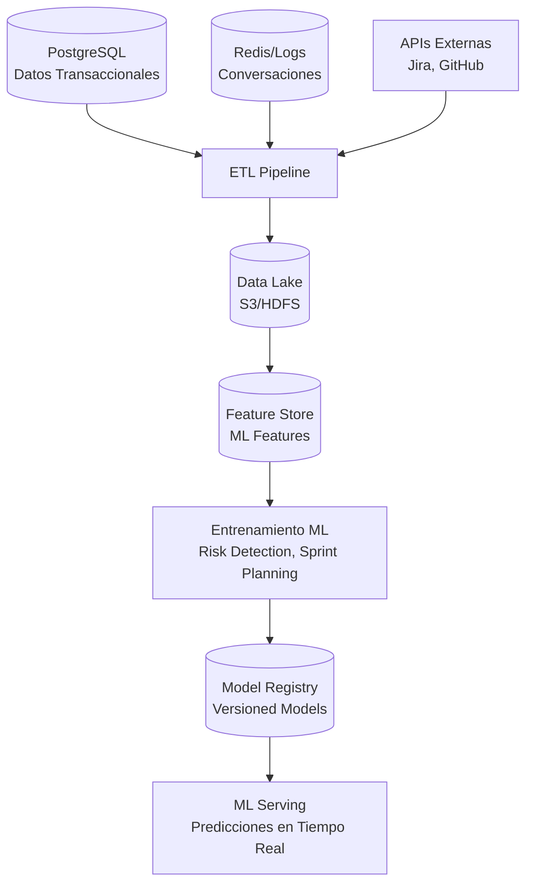

# Análisis de Arquitectura Técnica - PM-Bot

**Fecha:** 2025-07-13  
**Subagente:** Arquitecto de Software Senior  
**Especialización:** Sistemas Conversacionales e IA  
**Metodología:** Análisis con Google Gemini utilizando MCP Context7

---

## Resumen Ejecutivo

Este análisis propone una arquitectura de microservicios robusta y escalable para PM-Bot, considerando las necesidades específicas de un sistema conversacional con IA. La arquitectura está diseñada para manejar el crecimiento desde MVP hasta características avanzadas post-MVP, con énfasis en seguridad, escalabilidad y mantenibilidad.

## Arquitectura del Sistema (Visión General)

### Componentes Principales

La arquitectura propuesta consta de 10 componentes especializados:



#### 1. API Gateway
- **Responsabilidad:** Punto de entrada único para todas las interacciones del cliente
- **Funciones:** Autenticación básica, rate limiting, enrutamiento
- **Tecnología:** Kong, AWS API Gateway, o NGINX

#### 2. Servicio de Autenticación y Usuarios
- **Responsabilidad:** Gestión de registro, login, perfiles y sesiones
- **Funciones:** UC-001, UC-002, gestión JWT, OAuth 2.0
- **Tecnología:** Node.js/Express, Python/FastAPI, o Go

#### 3. Motor Conversacional
- **Responsabilidad:** "Cerebro" del bot, orquesta flujo de diálogo
- **Componentes:**
  - **Módulo NLU:** Interpretación de lenguaje natural
  - **Módulo de Gestión de Diálogo:** Lógica conversacional, manejo de ambigüedades
  - **Módulo de Contexto:** Estado temporal de conversación por usuario
- **Tecnología:** Python + Rasa/Custom NLP, Redis para estado

#### 4. Servicio de Gestión de Proyectos
- **Responsabilidad:** Lógica de negocio central (proyectos, tareas, asignaciones)
- **Funciones:** UC-003, UC-004, UC-005, UC-006
- **Tecnología:** Java/Spring Boot, C#/.NET, o Python/Django

#### 5. Servicio de Integraciones Externas
- **Responsabilidad:** Comunicación con APIs de terceros
- **Funciones:** Proveedores sociales (UC-001/002), Jira (UC-103)
- **Tecnología:** Node.js/Express con librerías OAuth específicas

#### 6. Servicio de Inteligencia de Proyectos (Post-MVP)
- **Responsabilidad:** IA para alertas de riesgo y asistencia en planificación
- **Funciones:** UC-101, UC-102
- **Tecnología:** Python + scikit-learn/TensorFlow/PyTorch

#### 7. Servicio de Notificaciones
- **Responsabilidad:** Envío de emails, alertas proactivas
- **Tecnología:** SendGrid, AWS SES, o servicio similar

#### 8. Base de Datos Relacional
- **Responsabilidad:** Persistencia de datos estructurados
- **Tecnología:** PostgreSQL (recomendado) o MySQL
- **Datos:** Usuarios, proyectos, tareas, sprints, mapeos de integración

#### 9. Cache/Base de Datos en Memoria
- **Responsabilidad:** Estado conversacional, sesiones, datos de acceso frecuente
- **Tecnología:** Redis (recomendado) o Memcached

#### 10. Cola de Mensajes
- **Responsabilidad:** Comunicación asíncrona entre microservicios
- **Tecnología:** Apache Kafka (alto volumen) o RabbitMQ (simplicidad)
- **Uso:** Eventos de tarea completada, alertas de riesgo, sincronización Jira

## Patrones de Diseño Recomendados

### 1. Microservicios
- **Beneficio:** Desacoplamiento, escalabilidad independiente, tecnologías diversas
- **Implementación:** Cada servicio con su propia base de datos, APIs REST/GraphQL

### 2. Command Pattern
- **Uso:** Ejecución de acciones conversacionales (crear tarea, actualizar estado)
- **Beneficio:** Desacoplamiento de comando y ejecución, facilita undo/redo

### 3. Strategy Pattern
- **Uso:** Lógica de onboarding (UC-003) y metodologías de planificación (UC-102)
- **Beneficio:** Fácil extensión para nuevas metodologías y flujos

### 4. Repository Pattern
- **Uso:** Abstracción de la capa de persistencia
- **Beneficio:** Facilita testing, cambio de base de datos, caching transparente

### 5. Circuit Breaker
- **Uso:** Llamadas a APIs externas (UC-103, proveedores sociales)
- **Beneficio:** Previene fallos en cascada, mejora resiliencia

### 6. Saga Pattern
- **Uso:** Transacciones distribuidas (registro + envío de email)
- **Beneficio:** Consistencia eventual en operaciones multi-servicio

### 7. State Machine
- **Uso:** Gestión de diálogos complejos y resolución de ambigüedades (UC-007)
- **Beneficio:** Flujos conversacionales predecibles y manejables

### 8. Event-Driven Architecture
- **Uso:** Operaciones asíncronas, comunicación entre servicios
- **Beneficio:** Desacoplamiento temporal, escalabilidad, resilencia

## Manejo de Estado

### Estado Conversacional
- **Almacenamiento:** Redis con TTL (Time-To-Live)
- **Estructura por session_id:**
  ```json
  {
    "user_id": "123",
    "current_intent": "create_task",
    "entities": {
      "task_title": "Diseñar login",
      "assignee": null,
      "due_date": null
    },
    "conversation_step": "awaiting_assignee",
    "context": ["previous_task_mentioned"],
    "last_activity": "2025-07-13T10:30:00Z"
  }
  ```

### Estado de Aplicación
- **Persistencia:** PostgreSQL con esquema optimizado
- **Entidades principales:** Users, Projects, Tasks, Teams, Integrations

### Sesiones de Usuario
- **Implementación:** JWT para APIs (stateless)
- **Alternativa:** Sesiones en Redis para flujos OAuth complejos

## Escalabilidad

### Escalado Horizontal
- **Diseño:** Servicios stateless (excepto estado conversacional en Redis)
- **Implementación:** Balanceadores de carga, contenedores Docker, Kubernetes

### Escalado de Base de Datos
- **Lectura:** Réplicas de lectura para consultas (UC-005)
- **Escritura:** Particionamiento (sharding) si el volumen lo justifica
- **Cache:** Redis para datos frecuentemente consultados

### Asincronía
- **Cola de Mensajes:** Para operaciones no inmediatas
  - Envío de emails
  - Procesamiento de alertas de riesgo
  - Sincronización Jira en segundo plano
- **Beneficio:** Desacoplamiento, manejo de picos de carga

### Caching Estratégico
- **Nivel de aplicación:** Redis para métricas de proyecto (UC-005)
- **Nivel de consulta:** Cache de resultados de consultas complejas
- **CDN:** Para assets estáticos y contenido de UI

## Seguridad

### Autenticación y Autorización

#### OAuth 2.0 / OpenID Connect
- **Uso:** Registro/login social (UC-001, UC-002), integración Jira (UC-103)
- **Implementación:** Librerías estándar (passport.js, spring-security-oauth2)

#### JWT (JSON Web Tokens)
- **Uso:** Autenticación en APIs internas
- **Configuración:** 
  - Algoritmo: RS256 (asimétrico)
  - Expiración: 15 minutos (access token), 7 días (refresh token)
  - Claims: user_id, roles, permissions

#### RBAC (Role-Based Access Control)
- **Roles definidos:**
  - `project_manager`: Acceso completo al proyecto
  - `team_member`: Acceso limitado (tareas asignadas)
  - `admin`: Acceso al sistema

### Protección de Datos

#### Cifrado en Tránsito
- **HTTPS:** TLS 1.3 en todas las comunicaciones
- **Certificados:** Let's Encrypt o certificados corporativos

#### Cifrado en Reposo
- **Base de datos:** Cifrado a nivel de columna para datos sensibles
- **Archivos:** Cifrado de volúmenes/discos

#### Password Hashing
- **Algoritmo:** Argon2 (recomendado) o bcrypt
- **Configuración:** 
  ```javascript
  // Ejemplo Argon2
  const argon2 = require('argon2');
  const hash = await argon2.hash(password, {
    type: argon2.argon2id,
    memoryCost: 2 ** 16, // 64 MB
    timeCost: 3,
    parallelism: 1,
  });
  ```

#### Validación de Entrada
- **Sanitización:** Todas las entradas de usuario
- **Validación:** Esquemas estrictos (Joi, Zod, JSONSchema)
- **Prevención:** SQL injection, XSS, CSRF

### Protección contra Ataques

#### Rate Limiting
- **Endpoints críticos:** Login, registro, reset de contraseña
- **Implementación:** Redis + express-rate-limit o equivalente
- **Configuración:**
  ```javascript
  // Ejemplo: máximo 5 intentos de login por IP cada 15 minutos
  const loginLimiter = rateLimit({
    windowMs: 15 * 60 * 1000, // 15 minutos
    max: 5,
    message: 'Demasiados intentos de login, intenta de nuevo en 15 minutos'
  });
  ```

#### CAPTCHA/reCAPTCHA
- **Trigger:** Después de 3 intentos fallidos
- **Implementación:** Google reCAPTCHA v3 o hCaptcha

#### Gestión de Secretos
- **Desarrollo:** Variables de entorno + .env files
- **Producción:** HashiCorp Vault, AWS KMS, Azure Key Vault
- **Principio:** Nunca hardcodear credenciales en el código

## Integración con APIs Externas

### Servicio Dedicado de Integraciones
- **Responsabilidad:** Centralizar toda la lógica de terceros
- **Patrón:** Adapter pattern para diferentes APIs

### OAuth 2.0 Flow


### Manejo de Errores Robusto

#### Reintentos con Backoff Exponencial
```python
import asyncio
import aiohttp
from asyncio import sleep

async def call_external_api_with_retry(url, data, max_retries=3):
    for attempt in range(max_retries):
        try:
            async with aiohttp.ClientSession() as session:
                async with session.post(url, json=data) as response:
                    if response.status == 200:
                        return await response.json()
                    elif response.status >= 500:
                        # Error del servidor, reintenta
                        if attempt < max_retries - 1:
                            await sleep(2 ** attempt)  # Backoff exponencial
                            continue
                    else:
                        # Error del cliente, no reintenta
                        raise Exception(f"Client error: {response.status}")
        except Exception as e:
            if attempt == max_retries - 1:
                raise e
            await sleep(2 ** attempt)
```

#### Circuit Breaker Implementation
```python
class CircuitBreaker:
    def __init__(self, failure_threshold=5, timeout=60):
        self.failure_threshold = failure_threshold
        self.timeout = timeout
        self.failure_count = 0
        self.last_failure_time = None
        self.state = "CLOSED"  # CLOSED, OPEN, HALF_OPEN
    
    def call(self, func, *args, **kwargs):
        if self.state == "OPEN":
            if time.time() - self.last_failure_time > self.timeout:
                self.state = "HALF_OPEN"
            else:
                raise Exception("Circuit breaker is OPEN")
        
        try:
            result = func(*args, **kwargs)
            self.reset()
            return result
        except Exception as e:
            self.record_failure()
            raise e
```

#### Colas de Mensajes para Sincronización
- **Dead Letter Queues:** Para mensajes fallidos
- **Retry Policies:** Configurables por tipo de operación
- **Monitoreo:** Alertas para fallos persistentes

### Mapeo de Datos (UC-103)
```sql
-- Tabla de mapeo de usuarios
CREATE TABLE user_mappings (
    id SERIAL PRIMARY KEY,
    pmbot_user_id INTEGER REFERENCES users(id),
    external_system VARCHAR(50) NOT NULL, -- 'jira', 'github', etc.
    external_user_id VARCHAR(255) NOT NULL,
    external_email VARCHAR(255),
    created_at TIMESTAMP DEFAULT NOW(),
    UNIQUE(pmbot_user_id, external_system)
);

-- Tabla de mapeo de estados
CREATE TABLE status_mappings (
    id SERIAL PRIMARY KEY,
    pmbot_status VARCHAR(50) NOT NULL, -- 'todo', 'in_progress', 'done'
    external_system VARCHAR(50) NOT NULL,
    external_status VARCHAR(100) NOT NULL, -- 'Backlog', 'In Progress', 'Resolved'
    project_id INTEGER REFERENCES projects(id),
    created_at TIMESTAMP DEFAULT NOW(),
    UNIQUE(pmbot_status, external_system, project_id)
);
```

### Webhooks para Tiempo Real
- **Jira webhooks:** Para recibir actualizaciones en lugar de polling
- **Validación:** Signatures para verificar origen
- **Procesamiento:** Asíncrono mediante colas de mensajes

## Procesamiento de Lenguaje Natural (NLP)

### Enfoque Híbrido (MVP → Evolución)

#### MVP: NLU Basado en Reglas
```python
import re
from datetime import datetime, timedelta

class SimplifiedNLU:
    def __init__(self):
        self.intent_patterns = {
            'create_task': [
                r'crear?\s+tarea.*',
                r'nueva?\s+tarea.*',
                r'agregar?\s+tarea.*'
            ],
            'update_status': [
                r'(completé|terminé|acabé).*tarea',
                r'marcar?\s+como\s+(completad|terminad)',
                r'(done|hecho).*tarea'
            ],
            'get_status': [
                r'cómo\s+(vamos|va)\s*\??',
                r'status\s+del?\s+proyecto',
                r'estado\s+del?\s+proyecto'
            ]
        }
        
        self.entity_extractors = {
            'assignee': self._extract_assignee,
            'due_date': self._extract_due_date,
            'task_title': self._extract_task_title
        }
    
    def analyze(self, text):
        intent = self._classify_intent(text)
        entities = self._extract_entities(text, intent)
        confidence = self._calculate_confidence(text, intent, entities)
        
        return {
            'intent': intent,
            'entities': entities,
            'confidence': confidence
        }
    
    def _extract_due_date(self, text):
        # Patrones para fechas comunes
        patterns = {
            r'mañana': lambda: datetime.now() + timedelta(days=1),
            r'(el\s+)?viernes': lambda: self._next_weekday(4),  # 4 = Friday
            r'(\d{1,2})/(\d{1,2})': lambda m: datetime(2025, int(m.group(2)), int(m.group(1))),
        }
        
        for pattern, date_func in patterns.items():
            match = re.search(pattern, text.lower())
            if match:
                return date_func() if callable(date_func) else date_func(match)
        return None
```

#### Post-MVP: Modelo ML
- **Framework:** Rasa Open Source o Transformers (BERT, DistilBERT)
- **Entrenamiento:** Datos conversacionales reales + sintéticos
- **Métricas:** Intent accuracy >90%, Entity F1-score >85%

```python
# Ejemplo con transformers
from transformers import AutoTokenizer, AutoModelForTokenClassification
from transformers import pipeline

class MLBasedNLU:
    def __init__(self):
        self.intent_classifier = pipeline(
            "text-classification",
            model="microsoft/DialoGPT-medium"  # Ejemplo
        )
        
        self.entity_extractor = pipeline(
            "ner",
            model="dbmdz/bert-large-cased-finetuned-conll03-english",
            aggregation_strategy="simple"
        )
    
    def analyze(self, text):
        intent_result = self.intent_classifier(text)
        entities = self.entity_extractor(text)
        
        return {
            'intent': intent_result[0]['label'],
            'confidence': intent_result[0]['score'],
            'entities': self._process_entities(entities)
        }
```

### Gestión de Diálogo

#### Máquina de Estados para UC-007
```python
from enum import Enum

class DialogueState(Enum):
    INITIAL = "initial"
    AWAITING_TASK_TITLE = "awaiting_task_title"
    AWAITING_ASSIGNEE = "awaiting_assignee"
    AWAITING_DUE_DATE = "awaiting_due_date"
    CONFIRMING_TASK = "confirming_task"
    COMPLETED = "completed"

class DialogueManager:
    def __init__(self):
        self.state_transitions = {
            DialogueState.INITIAL: {
                'create_task': self._handle_create_task_intent
            },
            DialogueState.AWAITING_ASSIGNEE: {
                'provide_assignee': self._handle_assignee_provided
            },
            # ... más transiciones
        }
    
    def process_user_input(self, session_id, nlu_result):
        current_state = self._get_session_state(session_id)
        intent = nlu_result['intent']
        
        if current_state in self.state_transitions:
            if intent in self.state_transitions[current_state]:
                handler = self.state_transitions[current_state][intent]
                return handler(session_id, nlu_result)
        
        return self._handle_clarification_needed(session_id, nlu_result)
```

### Feedback Loop para Mejora Continua
```sql
-- Tabla para almacenar correcciones del usuario
CREATE TABLE user_corrections (
    id SERIAL PRIMARY KEY,
    session_id VARCHAR(255) NOT NULL,
    original_text TEXT NOT NULL,
    bot_interpretation JSONB NOT NULL, -- Intent + entities detectadas
    user_correction JSONB NOT NULL,    -- Intent + entities correctas
    correction_type VARCHAR(50) NOT NULL, -- 'intent', 'entity', 'both'
    created_at TIMESTAMP DEFAULT NOW()
);

-- Tabla para feedback de alertas (UC-101)
CREATE TABLE alert_feedback (
    id SERIAL PRIMARY KEY,
    alert_id INTEGER REFERENCES risk_alerts(id),
    user_id INTEGER REFERENCES users(id),
    feedback VARCHAR(20) NOT NULL, -- 'relevant', 'irrelevant', 'false_positive'
    feedback_text TEXT,
    created_at TIMESTAMP DEFAULT NOW()
);
```

## Persistencia de Datos

### Esquema de Base de Datos Optimizado

```sql
-- Usuarios y autenticación
CREATE TABLE users (
    id SERIAL PRIMARY KEY,
    email VARCHAR(255) UNIQUE NOT NULL,
    password_hash VARCHAR(255), -- NULL para usuarios OAuth únicamente
    full_name VARCHAR(255) NOT NULL,
    avatar_url VARCHAR(500),
    email_verified BOOLEAN DEFAULT FALSE,
    created_at TIMESTAMP DEFAULT NOW(),
    updated_at TIMESTAMP DEFAULT NOW()
);

-- Métodos de autenticación
CREATE TABLE auth_methods (
    id SERIAL PRIMARY KEY,
    user_id INTEGER REFERENCES users(id),
    provider VARCHAR(50) NOT NULL, -- 'local', 'google', 'github'
    provider_id VARCHAR(255), -- ID en el proveedor externo
    metadata JSONB, -- Información adicional del proveedor
    created_at TIMESTAMP DEFAULT NOW(),
    UNIQUE(provider, provider_id)
);

-- Proyectos
CREATE TABLE projects (
    id SERIAL PRIMARY KEY,
    name VARCHAR(255) NOT NULL,
    description TEXT,
    owner_id INTEGER REFERENCES users(id),
    methodology VARCHAR(50) DEFAULT 'agile', -- 'agile', 'kanban', 'waterfall'
    settings JSONB DEFAULT '{}', -- Configuraciones específicas del proyecto
    created_at TIMESTAMP DEFAULT NOW(),
    updated_at TIMESTAMP DEFAULT NOW()
);

-- Miembros del proyecto
CREATE TABLE project_members (
    id SERIAL PRIMARY KEY,
    project_id INTEGER REFERENCES projects(id),
    user_id INTEGER REFERENCES users(id),
    role VARCHAR(50) DEFAULT 'member', -- 'owner', 'manager', 'member'
    joined_at TIMESTAMP DEFAULT NOW(),
    UNIQUE(project_id, user_id)
);

-- Tareas
CREATE TABLE tasks (
    id SERIAL PRIMARY KEY,
    project_id INTEGER REFERENCES projects(id),
    title VARCHAR(500) NOT NULL,
    description TEXT,
    status VARCHAR(50) DEFAULT 'todo', -- 'todo', 'in_progress', 'done', 'blocked'
    assignee_id INTEGER REFERENCES users(id),
    creator_id INTEGER REFERENCES users(id),
    due_date DATE,
    priority VARCHAR(20) DEFAULT 'medium', -- 'low', 'medium', 'high', 'urgent'
    story_points INTEGER, -- Para metodologías ágiles
    external_id VARCHAR(255), -- ID en sistema externo (Jira)
    external_system VARCHAR(50), -- 'jira', 'github', etc.
    created_at TIMESTAMP DEFAULT NOW(),
    updated_at TIMESTAMP DEFAULT NOW()
);

-- Auditoría de cambios
CREATE TABLE task_history (
    id SERIAL PRIMARY KEY,
    task_id INTEGER REFERENCES tasks(id),
    user_id INTEGER REFERENCES users(id),
    field_changed VARCHAR(100) NOT NULL,
    old_value TEXT,
    new_value TEXT,
    changed_at TIMESTAMP DEFAULT NOW()
);

-- Índices para optimización
CREATE INDEX idx_tasks_project_status ON tasks(project_id, status);
CREATE INDEX idx_tasks_assignee_status ON tasks(assignee_id, status);
CREATE INDEX idx_tasks_due_date ON tasks(due_date) WHERE due_date IS NOT NULL;
CREATE INDEX idx_task_history_task_id ON task_history(task_id);
```

### Optimizaciones de Performance

#### Índices Estratégicos
```sql
-- Para consultas de estado de proyecto (UC-005)
CREATE INDEX idx_tasks_project_metrics ON tasks(project_id, status, updated_at);

-- Para búsqueda de tareas por texto
CREATE INDEX idx_tasks_title_search ON tasks USING gin(to_tsvector('spanish', title));

-- Para consultas de usuario
CREATE INDEX idx_tasks_user_workload ON tasks(assignee_id, status) WHERE status != 'done';
```

#### Vistas Materializadas para Métricas
```sql
-- Vista para métricas de proyecto
CREATE MATERIALIZED VIEW project_metrics AS
SELECT 
    p.id as project_id,
    p.name as project_name,
    COUNT(t.id) as total_tasks,
    COUNT(CASE WHEN t.status = 'done' THEN 1 END) as completed_tasks,
    COUNT(CASE WHEN t.status = 'in_progress' THEN 1 END) as in_progress_tasks,
    COUNT(CASE WHEN t.status = 'blocked' THEN 1 END) as blocked_tasks,
    ROUND(
        COUNT(CASE WHEN t.status = 'done' THEN 1 END)::decimal / 
        NULLIF(COUNT(t.id), 0) * 100, 2
    ) as completion_percentage,
    MAX(t.updated_at) as last_activity
FROM projects p
LEFT JOIN tasks t ON p.id = t.project_id
GROUP BY p.id, p.name;

-- Refrescar automáticamente cada 5 minutos
CREATE OR REPLACE FUNCTION refresh_project_metrics()
RETURNS void AS $$
BEGIN
    REFRESH MATERIALIZED VIEW CONCURRENTLY project_metrics;
END;
$$ LANGUAGE plpgsql;

-- Programar refresco automático (requiere pg_cron extension)
SELECT cron.schedule('refresh-project-metrics', '*/5 * * * *', 'SELECT refresh_project_metrics();');
```

### Redis para Estado Conversacional

#### Estructura de Datos
```json
{
  "session:user123:conv456": {
    "user_id": 123,
    "project_id": 789,
    "current_intent": "create_task",
    "entities": {
      "task_title": "Implementar autenticación OAuth",
      "assignee": null,
      "due_date": null
    },
    "conversation_step": "awaiting_assignee",
    "context": {
      "last_mentioned_tasks": [101, 102],
      "current_project_context": true
    },
    "dialog_history": [
      {
        "timestamp": "2025-07-13T10:30:00Z",
        "user_input": "Crear tarea para OAuth",
        "bot_response": "¿A quién asigno la tarea 'Implementar autenticación OAuth'?",
        "intent": "create_task",
        "entities_extracted": ["task_title"]
      }
    ],
    "last_activity": "2025-07-13T10:30:00Z",
    "ttl": 3600
  }
}
```

#### Configuración Redis
```python
import redis
import json
from datetime import timedelta

class ConversationStateManager:
    def __init__(self):
        self.redis_client = redis.Redis(
            host='localhost',
            port=6379,
            db=0,
            decode_responses=True
        )
        self.default_ttl = 3600  # 1 hora
    
    def save_state(self, session_id, state):
        key = f"session:{session_id}"
        serialized_state = json.dumps(state, default=str)
        self.redis_client.setex(key, self.default_ttl, serialized_state)
    
    def get_state(self, session_id):
        key = f"session:{session_id}"
        serialized_state = self.redis_client.get(key)
        if serialized_state:
            return json.loads(serialized_state)
        return None
    
    def extend_session(self, session_id):
        key = f"session:{session_id}"
        self.redis_client.expire(key, self.default_ttl)
```

### Data Lake para IA (Post-MVP)

#### Arquitectura de Datos para ML


## Riesgos Técnicos y Soluciones

### 1. Complejidad y Precisión del NLP

#### Riesgo
El NLU "simplificado" del MVP podría llevar a interpretaciones erróneas frecuentes, frustrando al usuario.

#### Solución Arquitectónica
- **Modularidad:** Separar NLU del Motor Conversacional para fácil reemplazo
- **Diseño de Diálogo Robusto:** Máquinas de estado que pidan clarificaciones activamente cuando la confianza es baja
- **Feedback Loop:** Sistema para que usuarios corrijan al bot (UC-007)
- **Enfoque Gradual:** Empezar con reglas bien definidas, migrar a ML gradualmente

#### Implementación
```python
class RobustDialogueManager:
    def __init__(self, confidence_threshold=0.7):
        self.confidence_threshold = confidence_threshold
    
    def process_input(self, text, session_id):
        nlu_result = self.nlu.analyze(text)
        
        if nlu_result['confidence'] < self.confidence_threshold:
            return self._request_clarification(nlu_result, session_id)
        
        if self._has_missing_entities(nlu_result):
            return self._request_missing_entities(nlu_result, session_id)
        
        return self._execute_intent(nlu_result, session_id)
```

### 2. Consistencia de Datos en Integraciones Externas

#### Riesgo
Mapeo complejo de usuarios/estados, conflictos de actualización, fallos de conectividad pueden llevar a datos desincronizados.

#### Solución Arquitectónica
- **Servicio de Integración Dedicado:** Aísla lógica de terceros
- **Idempotencia:** Operaciones de sincronización idempotentes
- **Manejo de Conflictos:** Política "último cambio gana" + notificación manual
- **Colas de Mensajes:** Para reintentos y manejo de fallos
- **Monitoreo Extensivo:** Alertas en tiempo real

#### Implementación
```python
class JiraIntegrationService:
    def __init__(self):
        self.circuit_breaker = CircuitBreaker()
        self.message_queue = MessageQueue()
    
    @idempotent
    async def sync_task_update(self, task_id, updates):
        try:
            # Verificar timestamp de última actualización
            local_task = await self.get_local_task(task_id)
            if updates['last_modified'] <= local_task['last_modified']:
                return  # No necesita actualización
            
            # Actualizar en Jira con circuit breaker
            jira_response = await self.circuit_breaker.call(
                self.jira_client.update_issue, 
                local_task['external_id'], 
                updates
            )
            
            # Actualizar localmente
            await self.update_local_task(task_id, updates)
            
        except Exception as e:
            # Encolar para reintento
            await self.message_queue.enqueue('sync_retry', {
                'task_id': task_id,
                'updates': updates,
                'attempt': 1,
                'error': str(e)
            })
            raise e
```

### 3. Escalabilidad de Base de Datos

#### Riesgo
Consultas lentas a medida que crecen usuarios y proyectos.

#### Solución Arquitectónica
- **Optimización de Esquema:** Índices estratégicos, normalización apropiada
- **Separación de Carga:** Réplicas de lectura para consultas
- **Caching:** Redis para resultados frecuentes
- **Asincronía:** Operaciones no críticas en background

#### Implementación
```python
class ProjectMetricsService:
    def __init__(self):
        self.read_db = get_read_replica_connection()
        self.write_db = get_primary_db_connection()
        self.cache = RedisCache()
    
    async def get_project_status(self, project_id):
        # Intentar desde cache primero
        cache_key = f"project_status:{project_id}"
        cached_result = await self.cache.get(cache_key)
        if cached_result:
            return cached_result
        
        # Consultar desde réplica de lectura
        result = await self.read_db.fetch_one("""
            SELECT * FROM project_metrics 
            WHERE project_id = $1
        """, project_id)
        
        # Cachear resultado por 5 minutos
        await self.cache.set(cache_key, result, ttl=300)
        return result
```

### 4. Seguridad de Información Sensible

#### Riesgo
Contraseñas, tokens, datos de integración son objetivos críticos.

#### Solución Arquitectónica
- **Cifrado de Contraseñas:** Argon2/bcrypt con salts robustos
- **HTTPS Everywhere:** TLS 1.3 en todas las comunicaciones
- **Cifrado en Reposo:** Base de datos y almacenamiento cifrados
- **Gestión de Secretos:** Vault/KMS, nunca hardcodear
- **Auditorías:** Pruebas de penetración regulares

#### Implementación
```python
import hashlib
import secrets
from cryptography.fernet import Fernet

class SecurityManager:
    def __init__(self):
        self.encryption_key = self._get_encryption_key()
        self.cipher_suite = Fernet(self.encryption_key)
    
    async def hash_password(self, password):
        # Usar Argon2 para hash de contraseñas
        import argon2
        ph = argon2.PasswordHasher()
        return ph.hash(password)
    
    def encrypt_token(self, token):
        # Cifrar tokens de API externa
        return self.cipher_suite.encrypt(token.encode()).decode()
    
    def decrypt_token(self, encrypted_token):
        return self.cipher_suite.decrypt(encrypted_token.encode()).decode()
    
    def generate_secure_session_id(self):
        return secrets.token_urlsafe(32)
```

## Plan de Implementación Técnica

### Fase 1: MVP Core (Semanas 1-8)

#### Semana 1-2: Infraestructura Base
- [ ] Configurar entorno de desarrollo (Docker, CI/CD)
- [ ] Provisionar servicios base (PostgreSQL, Redis, Message Queue)
- [ ] Implementar API Gateway básico
- [ ] Configurar monitoreo y logging

#### Semana 3-4: Autenticación y Usuarios
- [ ] Desarrollar Servicio de Autenticación
- [ ] Implementar registro/login con email (UC-001, UC-002)
- [ ] Integrar OAuth 2.0 (Google)
- [ ] Sistema de JWT y refresh tokens
- [ ] Rate limiting y protecciones básicas

#### Semana 5-6: Motor Conversacional MVP
- [ ] NLU basado en reglas para intents básicos
- [ ] Gestión de estado conversacional en Redis
- [ ] Diálogo manager con máquina de estados simple
- [ ] Manejo básico de clarificaciones (UC-007)

#### Semana 7-8: Gestión de Proyectos Core
- [ ] Servicio de Gestión de Proyectos
- [ ] CRUD de proyectos y tareas
- [ ] Implementar UC-003, UC-004, UC-005, UC-006
- [ ] APIs REST para frontend

### Fase 2: Mejoras y Optimización (Semanas 9-12)

#### Semana 9-10: Integraciones Externas
- [ ] Servicio de Integraciones dedicado
- [ ] Circuit breakers y retry logic
- [ ] Integración básica con Jira (UC-103)
- [ ] Webhooks para tiempo real

#### Semana 11-12: Performance y Escalabilidad
- [ ] Optimización de consultas de BD
- [ ] Implementar caching estratégico
- [ ] Réplicas de lectura
- [ ] Monitoreo de performance

### Fase 3: Post-MVP IA (Semanas 13-16)

#### Semana 13-14: Inteligencia de Proyectos
- [ ] Servicio de Project Intelligence
- [ ] Modelo básico de detección de riesgos (UC-101)
- [ ] Pipeline de datos para ML
- [ ] Alertas proactivas

#### Semana 15-16: Planificación Asistida por IA
- [ ] Asistencia en planificación de sprints (UC-102)
- [ ] Análisis de velocidad de equipo
- [ ] Recomendaciones inteligentes
- [ ] Dashboard de métricas avanzadas

## Métricas Técnicas de Éxito

### Performance
- **Latencia API:** <200ms para 95% de requests
- **Throughput:** 1000+ requests/segundo
- **Uptime:** 99.9% disponibilidad

### Escalabilidad
- **Usuarios Concurrentes:** 10,000+ sin degradación
- **Crecimiento de Datos:** Manejo lineal hasta 1M+ tareas
- **Response Time:** <500ms para consultas complejas

### Seguridad
- **Vulnerabilidades:** 0 críticas, <5 altas
- **Penetration Testing:** Trimestral con 0 issues críticos
- **Compliance:** GDPR, SOC 2 Type II

### Reliability
- **Error Rate:** <0.1% para operaciones críticas
- **Recovery Time:** <30 segundos para fallos de servicio
- **Data Consistency:** >99.99% en sincronización externa

---

*Este análisis técnico fue generado utilizando arquitectura de sistemas especializada mediante el servidor MCP de Google Gemini, incorporando mejores prácticas de la industria para sistemas conversacionales escalables.*